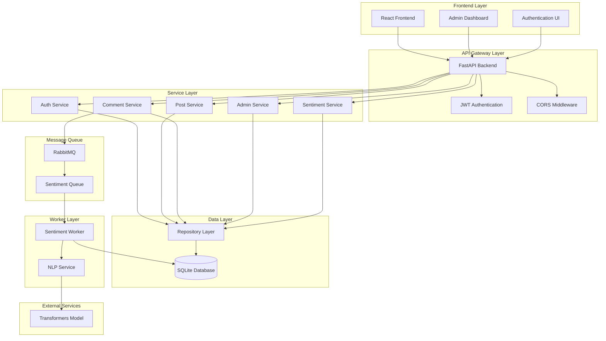
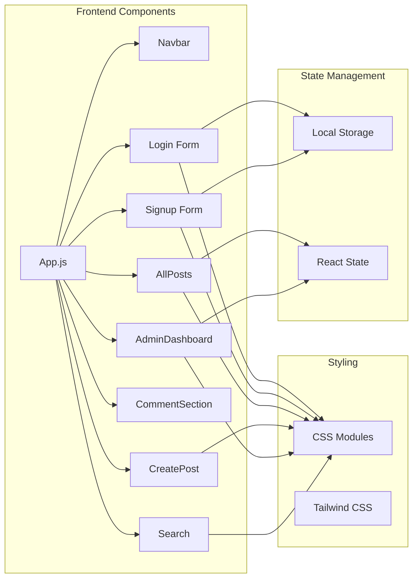
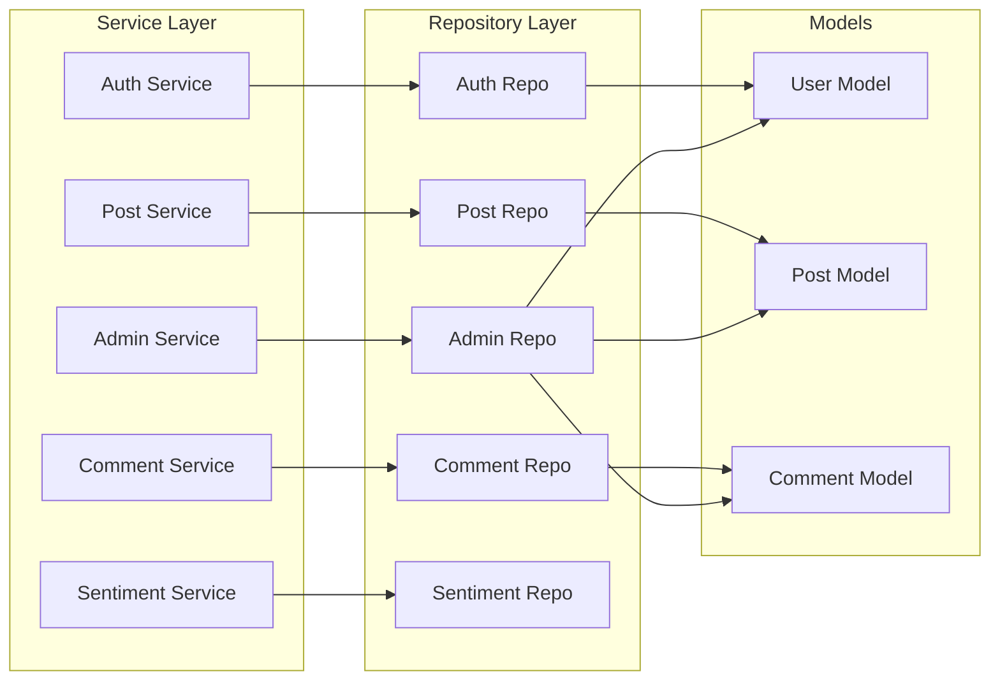
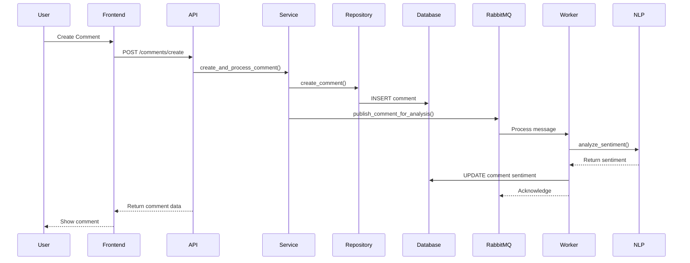
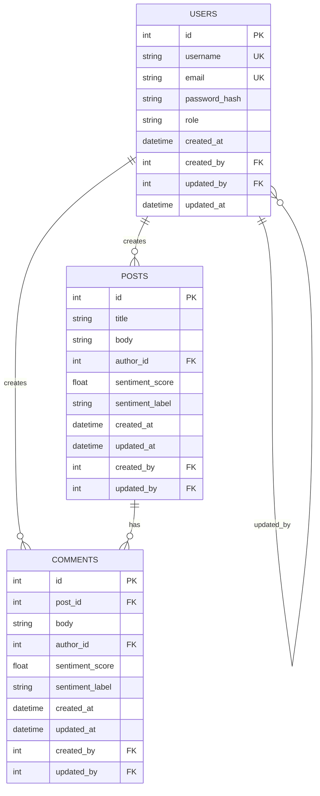
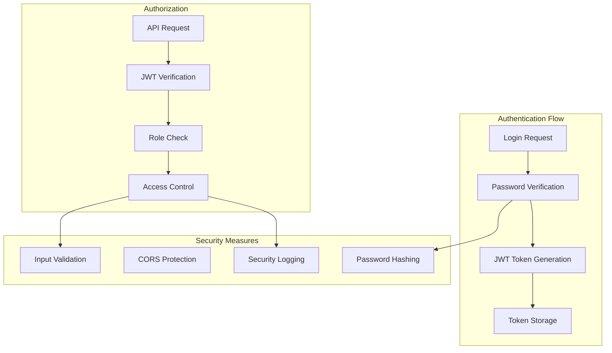
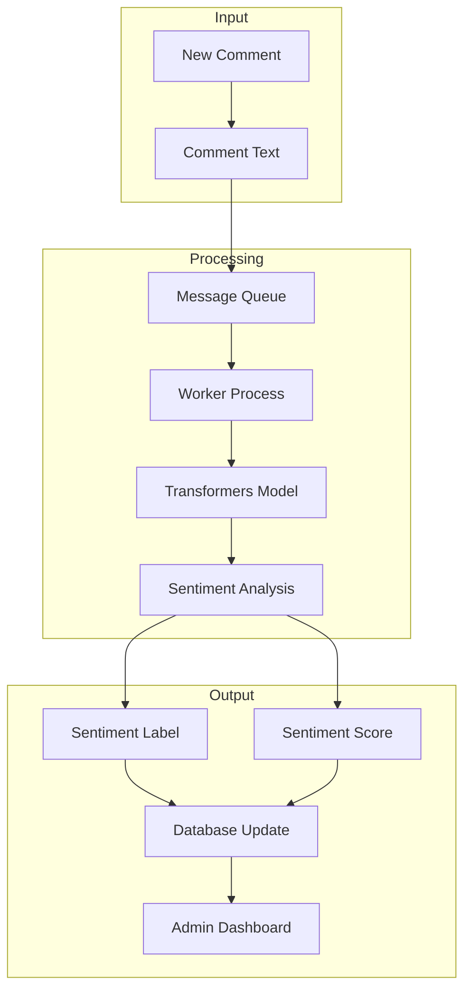
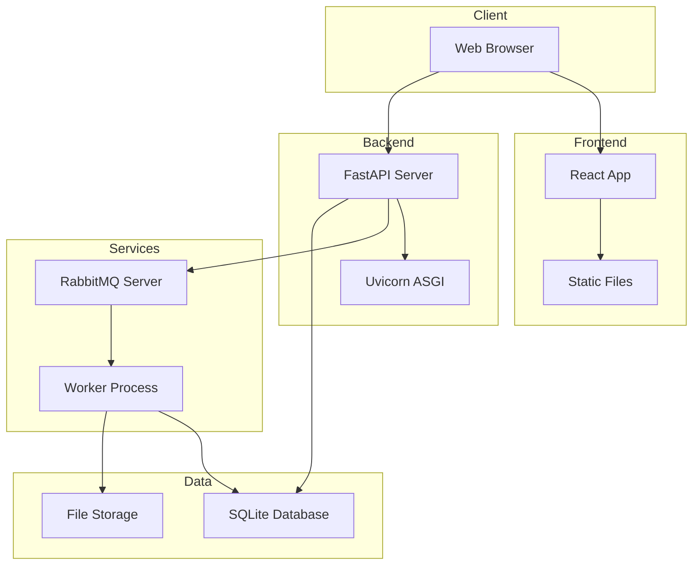

# 🏗️ MicroForum - Detailed Architecture Diagram

## 📋 System Overview

MicroForum is a full-stack forum application with real-time sentiment analysis, built using modern microservices architecture with message queuing for asynchronous processing.

---

## 🏛️ High-Level Architecture



---

## 🔧 Detailed Component Architecture

### 1. Frontend Layer (React)



### 2. Backend API Layer (FastAPI)

```mermaid
graph TB
    subgraph "API Routes"
        AuthAPI[/auth]
        PostAPI[/posts]
        CommentAPI[/comments]
        AdminAPI[/admin]
    end
    
    subgraph "Middleware"
        JWT[JWT Verification]
        CORS[CORS Headers]
        Logging[Request Logging]
    end
    
    subgraph "Dependencies"
        DB[Database Session]
        User[Current User]
    end
    
    AuthAPI --> JWT
    PostAPI --> JWT
    CommentAPI --> JWT
    AdminAPI --> JWT
    
    JWT --> User
    User --> DB
    
    AuthAPI --> CORS
    PostAPI --> CORS
    CommentAPI --> CORS
    AdminAPI --> CORS
```

### 3. Service Layer Architecture



### 4. Data Flow Architecture



---

## 🗄️ Database Schema



---

## 🔄 Message Queue Flow

```mermaid
graph LR
    subgraph "Producer"
        Comment[Comment Creation]
        Publisher[Message Publisher]
    end
    
    subgraph "Queue"
        RMQ[RabbitMQ Server]
        Queue[Sentiment Queue]
    end
    
    subgraph "Consumer"
        Worker[Sentiment Worker]
        NLP[NLP Processing]
        DB[Database Update]
    end
    
    Comment --> Publisher
    Publisher --> RMQ
    RMQ --> Queue
    Queue --> Worker
    Worker --> NLP
    NLP --> DB
```

---

## 🔐 Security Architecture



---

## 📊 Sentiment Analysis Pipeline



---

## 🚀 Deployment Architecture



---

## 🔧 Technology Stack

### Frontend
- **Framework**: React 18
- **Styling**: CSS Modules + Tailwind CSS
- **HTTP Client**: Axios
- **Routing**: React Router
- **Charts**: Chart.js + React-Chartjs-2

### Backend
- **Framework**: FastAPI
- **ASGI Server**: Uvicorn
- **Database**: SQLite with SQLAlchemy ORM
- **Authentication**: JWT with PyJWT
- **Password Hashing**: Passlib with bcrypt
- **Message Queue**: RabbitMQ with pika
- **NLP**: Transformers (Hugging Face)

### DevOps
- **Containerization**: Docker
- **Orchestration**: Docker Compose
- **Version Control**: Git
- **Database Migrations**: Alembic

---

## 📈 Performance Considerations

### Caching Strategy
- JWT token caching in localStorage
- Database query optimization
- Static asset caching

### Scalability
- Message queue for async processing
- Stateless API design
- Database connection pooling
- Worker process isolation

### Monitoring
- Request/response logging
- Error tracking and reporting
- Performance metrics collection
- Sentiment analysis accuracy monitoring

---

## 🔄 Data Flow Summary

1. **User Authentication**: JWT-based stateless authentication
2. **Content Creation**: Posts and comments with real-time validation
3. **Sentiment Analysis**: Asynchronous processing via message queue
4. **Admin Dashboard**: Real-time sentiment analytics and user management
5. **Data Persistence**: ACID-compliant database operations
6. **Security**: Multi-layer security with input validation and authorization

This architecture provides a scalable, maintainable, and secure forum platform with advanced sentiment analysis capabilities. 