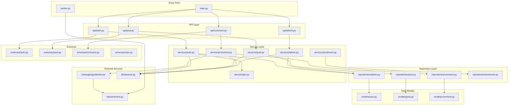
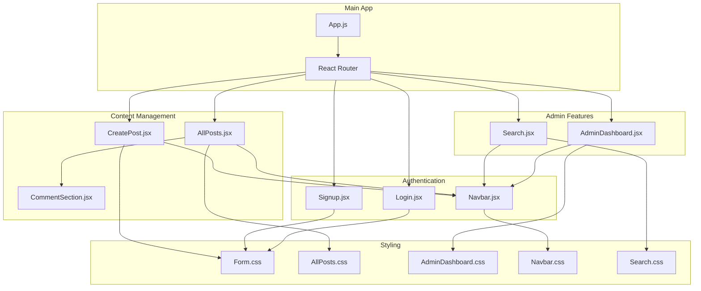
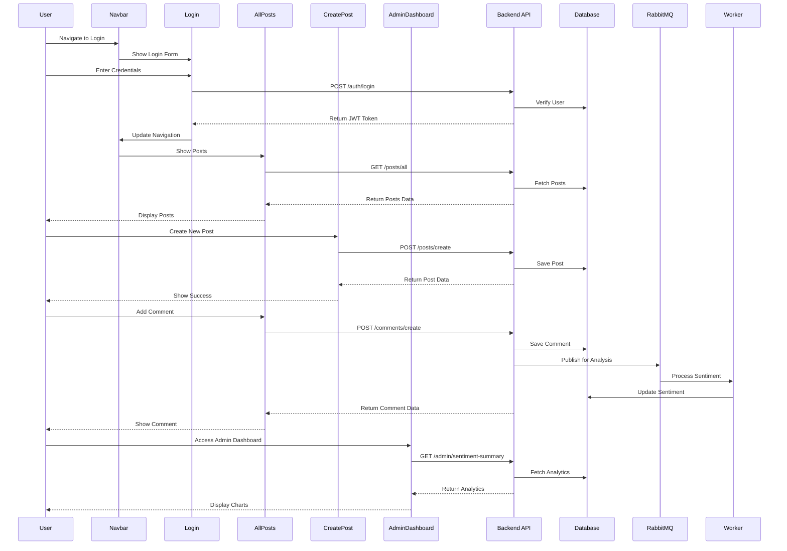
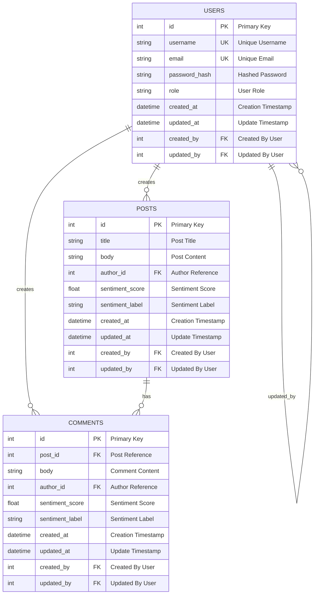
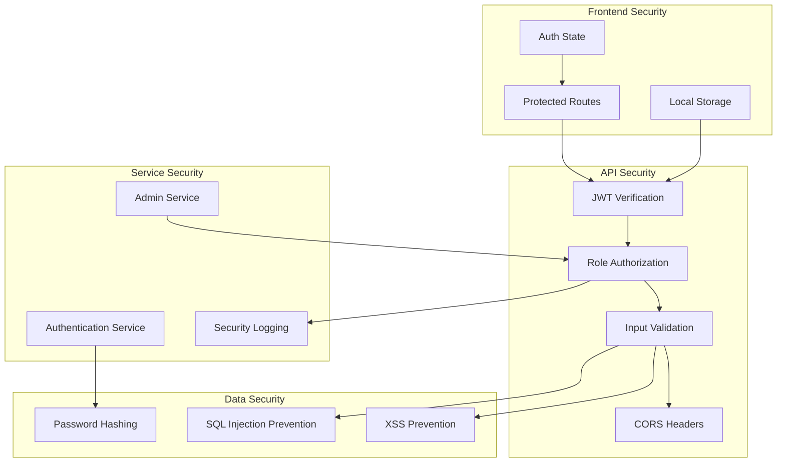
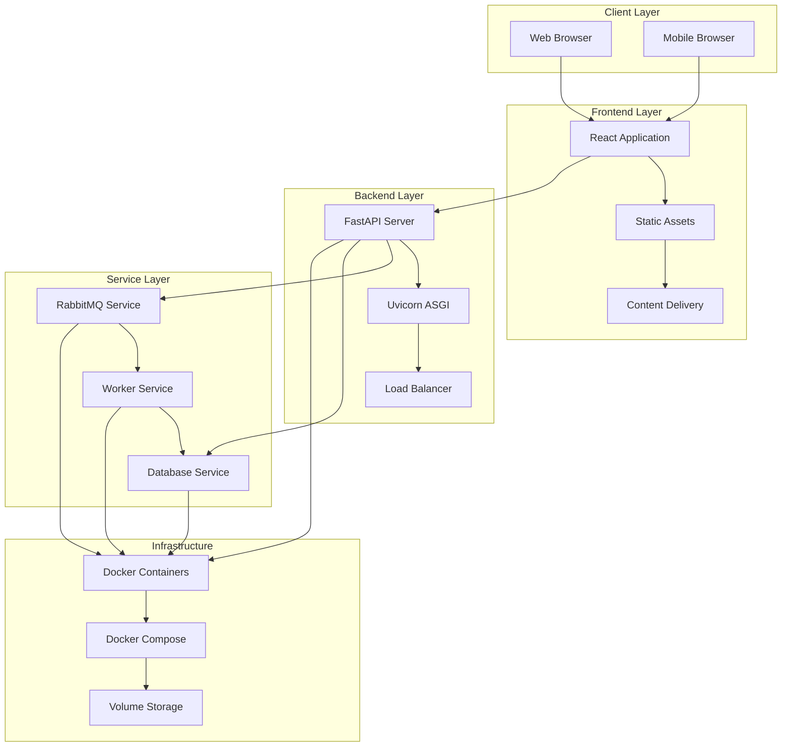

# 🧩 MicroForum - Component Structure Diagram

## 📁 Project Structure Overview

```
microforum-dev/
├── docker-compose.yml
├── MicroForum/
│   ├── backend/
│   │   ├── alembic/                    # Database migrations
│   │   ├── app/
│   │   │   ├── api/                    # API endpoints
│   │   │   ├── db/                     # Database configuration
│   │   │   ├── messaging/              # Message queue
│   │   │   ├── models/                 # Database models
│   │   │   ├── nlp/                    # NLP services
│   │   │   ├── repositories/           # Data access layer
│   │   │   ├── schemas/                # Pydantic schemas
│   │   │   ├── services/               # Business logic
│   │   │   └── main.py                 # FastAPI application
│   │   ├── requirements.txt
│   │   └── worker.py                   # Sentiment analysis worker
│   ├── frontend/
│   │   ├── src/
│   │   │   ├── components/             # React components
│   │   │   ├── styles/                 # CSS files
│   │   │   └── App.js                  # Main React app
│   │   └── package.json
│   └── documentation/
└── ARCHITECTURE_DIAGRAM.md
```

---

## 🔧 Backend Component Architecture



---

## 🎨 Frontend Component Architecture



---

## 🔄 Data Flow Between Components



---

## 🗄️ Database Schema Relationships



---

## 🔐 Security Component Flow



---

## 📊 Sentiment Analysis Component Flow

```mermaid
graph LR
    subgraph "Input Layer"
        CommentInput[Comment Creation]
        TextExtraction[Text Extraction]
    end
    
    subgraph "Queue Layer"
        MessagePublisher[Message Publisher]
        RabbitMQ[RabbitMQ Server]
        MessageConsumer[Message Consumer]
    end
    
    subgraph "Processing Layer"
        WorkerProcess[Worker Process]
        NLPService[NLP Service]
        ModelInference[Model Inference]
    end
    
    subgraph "Output Layer"
        SentimentResult[Sentiment Result]
        DatabaseUpdate[Database Update]
        DashboardUpdate[Dashboard Update]
    end
    
    CommentInput --> TextExtraction
    TextExtraction --> MessagePublisher
    MessagePublisher --> RabbitMQ
    RabbitMQ --> MessageConsumer
    MessageConsumer --> WorkerProcess
    WorkerProcess --> NLPService
    NLPService --> ModelInference
    ModelInference --> SentimentResult
    SentimentResult --> DatabaseUpdate
    DatabaseUpdate --> DashboardUpdate
```



---

## 🚀 Deployment Component Structure



---

## 📈 Component Dependencies

### Backend Dependencies
```yaml
FastAPI:
  - uvicorn
  - sqlalchemy
  - pydantic
  - python-jose[cryptography]
  - passlib[bcrypt]
  - python-multipart

Database:
  - sqlite3
  - alembic

Message Queue:
  - pika
  - rabbitmq-server

NLP:
  - transformers
  - torch
  - numpy

Testing:
  - pytest
  - pytest-asyncio
```

### Frontend Dependencies
```yaml
React:
  - react
  - react-dom
  - react-router-dom

HTTP Client:
  - axios

Styling:
  - tailwindcss
  - css modules

Charts:
  - chart.js
  - react-chartjs-2

Development:
  - @vitejs/plugin-react
  - vite
```

---

## 🔄 Component Communication Patterns

### 1. **Synchronous Communication**
- API calls between frontend and backend
- Database queries
- JWT token validation

### 2. **Asynchronous Communication**
- Message queue for sentiment analysis
- Worker process communication
- Event-driven updates

### 3. **State Management**
- React component state
- Local storage for authentication
- Global state for user sessions

### 4. **Error Handling**
- Try-catch blocks in services
- HTTP error responses
- Frontend error boundaries
- Logging and monitoring

This component architecture ensures modularity, maintainability, and scalability of the MicroForum application. 