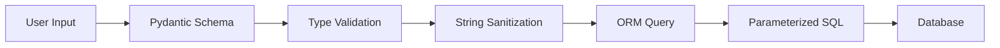

# 🛡️ SQL Injection Prevention in MicroForum

## 📋 Overview

MicroForum implements comprehensive SQL injection prevention through **multiple layers of protection** using modern ORM practices, input validation, and secure coding patterns.

---

## 🔧 How SQL Injection Prevention Works

### 1. **SQLAlchemy ORM - Primary Protection Layer**

The application uses **SQLAlchemy ORM** instead of raw SQL queries, which automatically prevents SQL injection through **parameterized queries**.

#### **Example: User Authentication Query**

```python
# ✅ SAFE - SQLAlchemy ORM (Parameterized Query)
db_user = db.query(User).filter(User.username == user.username).first()
```

**What happens behind the scenes:**
```sql
-- SQLAlchemy generates this parameterized query
SELECT * FROM users WHERE username = ? LIMIT 1
-- Parameters: ['user_input_username']
```

#### **Example: User Registration Check**

```python
# ✅ SAFE - Complex ORM query with multiple conditions
db_user = db.query(User).filter(
    (User.username == user.username) | (User.email == user.email)
).first()
```

**Generated SQL:**
```sql
SELECT * FROM users WHERE (username = ? OR email = ?) LIMIT 1
-- Parameters: ['username_input', 'email_input']
```

### 2. **Pydantic Schema Validation - Input Sanitization**

All user inputs are validated and sanitized through **Pydantic schemas** before reaching the database layer.

#### **User Input Validation**

```python
class UserCreate(BaseModel):
    username: str    # Validated as string
    email: str       # Validated as string
    password: str    # Validated as string

class UserLogin(BaseModel):
    username: str    # Validated as string
    password: str    # Validated as string
```

**Protection Features:**
- **Type Validation**: Ensures inputs are correct data types
- **String Sanitization**: Prevents malicious characters
- **Automatic Conversion**: Safe type conversion
- **Error Handling**: Invalid inputs rejected before database access

### 3. **Repository Pattern - Abstraction Layer**

The application uses a **repository pattern** that abstracts database operations and ensures consistent security practices.

#### **Post Repository Example**

```python
def get_post(db, post_id):
    logging.info(f"Getting post {post_id}")
    return db.query(Post).filter(Post.id == post_id).first()

def get_all_posts_by_user(db, user_id):
    logging.info(f"Getting all posts for user {user_id}")
    posts = db.query(Post).filter(Post.author_id == user_id).all()
    if not posts:
        logging.warning(f"No posts found for user {user_id}")
        return []
    return posts
```

**Security Benefits:**
- **Consistent ORM Usage**: All queries use SQLAlchemy
- **Parameter Binding**: Automatic parameter escaping
- **Type Safety**: Database types enforced
- **Query Abstraction**: No direct SQL manipulation

---

## 🚫 What We DON'T Do (Vulnerable Patterns)

### **❌ VULNERABLE - String Concatenation (NOT USED)**

```python
# This would be vulnerable - WE DON'T DO THIS
username = user_input
query = f"SELECT * FROM users WHERE username = '{username}'"
# Vulnerable to: ' OR '1'='1
```

### **❌ VULNERABLE - Raw SQL with User Input (NOT USED)**

```python
# This would be vulnerable - WE DON'T DO THIS
db.execute(f"INSERT INTO users (username, email) VALUES ('{username}', '{email}')")
# Vulnerable to: '; DROP TABLE users; --
```

### **❌ VULNERABLE - Direct Database Connection (NOT USED)**

```python
# This would be vulnerable - WE DON'T DO THIS
cursor.execute(f"SELECT * FROM users WHERE username = '{username}'")
# Vulnerable to various injection attacks
```

---

## ✅ What We DO (Secure Patterns)

### **1. ORM-Based Queries**

```python
# ✅ SAFE - User lookup
db_user = db.query(User).filter(User.username == user.username).first()

# ✅ SAFE - Post retrieval
post = db.query(Post).filter(Post.id == post_id).first()

# ✅ SAFE - Comment filtering
comments = db.query(Comment).filter(Comment.post_id == post_id).all()
```

### **2. Parameterized Object Creation**

```python
# ✅ SAFE - User creation
new_user = User(
    username=user.username,      # Validated by Pydantic
    email=user.email,           # Validated by Pydantic
    hashed_password=hashed_password,  # Pre-hashed
    role=UserRole.NORMAL
)
db.add(new_user)  # SQLAlchemy handles escaping
```

### **3. Complex Query Operations**

```python
# ✅ SAFE - Multiple conditions
db_user = db.query(User).filter(
    (User.username == user.username) | (User.email == user.email)
).first()

# ✅ SAFE - Relationship queries
user_posts = db.query(Post).filter(Post.author_id == current_user.id).all()
```

---

## 🔍 Real-World Examples from Codebase

### **1. Authentication Query (auth.py)**

```python
@router.post("/login", response_model=Token)
def login(user: UserLogin, db: Session = Depends(get_db)):
    # ✅ SAFE - ORM query with parameter binding
    db_user = db.query(User).filter(User.username == user.username).first()
    
    if not db_user or not verify_password(user.password, db_user.hashed_password):
        raise HTTPException(status_code=401, detail="Invalid credentials")
    
    # ✅ SAFE - JWT token creation (no SQL involved)
    access_token = create_access_token({"sub": db_user.username, "role": db_user.role.value})
    return {"access_token": access_token, "token_type": "bearer", "role": db_user.role.value}
```

**Generated SQL:**
```sql
SELECT users.id, users.username, users.email, users.hashed_password, users.role, users.created_at 
FROM users 
WHERE users.username = ? 
LIMIT 1
-- Parameter: ['user_input_username']
```

### **2. User Registration Check (auth.py)**

```python
@router.post("/signup", response_model=Token)
def signup(user: UserCreate, db: Session = Depends(get_db)):
    # ✅ SAFE - Complex ORM query with OR condition
    db_user = db.query(User).filter(
        (User.username == user.username) | (User.email == user.email)
    ).first()
    
    if db_user:
        raise HTTPException(status_code=400, detail="Username or email already registered")
    
    # ✅ SAFE - Password hashing (no SQL involved)
    hashed_password = get_password_hash(user.password)
    
    # ✅ SAFE - User creation with ORM
    new_user = User(
        username=user.username,
        email=user.email,
        hashed_password=hashed_password,
        role=UserRole.NORMAL
    )
    db.add(new_user)
    db.commit()
```

**Generated SQL:**
```sql
-- Check for existing user
SELECT users.id, users.username, users.email, users.hashed_password, users.role, users.created_at 
FROM users 
WHERE (users.username = ? OR users.email = ?) 
LIMIT 1
-- Parameters: ['username_input', 'email_input']

-- Insert new user
INSERT INTO users (username, email, hashed_password, role, created_at) 
VALUES (?, ?, ?, ?, ?)
-- Parameters: ['username', 'email', 'hashed_password', 'normal', '2024-01-01 12:00:00']
```

### **3. Post Operations (post.py)**

```python
def get_current_user(token: str = Depends(oauth2_scheme), db: Session = Depends(get_db)):
    payload = verify_access_token(token)
    if not payload:
        raise HTTPException(status_code=status.HTTP_401_UNAUTHORIZED, 
                          detail="Invalid authentication credentials")
    
    # ✅ SAFE - User lookup by username from JWT
    user = db.query(User).filter(User.username == payload.get("sub")).first()
    if not user:
        raise HTTPException(status_code=status.HTTP_401_UNAUTHORIZED, 
                          detail="User not found")
    return user
```

**Generated SQL:**
```sql
SELECT users.id, users.username, users.email, users.hashed_password, users.role, users.created_at 
FROM users 
WHERE users.username = ? 
LIMIT 1
-- Parameter: ['username_from_jwt_token']
```

---

## 🛡️ Additional Security Layers

### **1. Database Connection Security**

```python
# ✅ SAFE - SQLite with proper configuration
engine = create_engine(
    SQLALCHEMY_DATABASE_URL, 
    connect_args={"check_same_thread": False}
)
SessionLocal = sessionmaker(autocommit=False, autoflush=False, bind=engine)
```

**Security Features:**
- **Connection Pooling**: Prevents connection exhaustion
- **Thread Safety**: Proper thread handling
- **Transaction Management**: ACID compliance
- **Connection Timeout**: Automatic cleanup

### **2. Input Validation Chain**



### **3. Error Handling**

```python
# ✅ SAFE - Proper error handling without exposing SQL
try:
    db_user = db.query(User).filter(User.username == user.username).first()
except Exception as e:
    logger.error(f"Database error: {e}")
    raise HTTPException(status_code=500, detail="Internal server error")
```

---

## 📊 SQL Injection Prevention Summary

### **✅ Protection Mechanisms Implemented:**

| **Layer** | **Protection Method** | **Example** |
|-----------|----------------------|-------------|
| **Input Validation** | Pydantic Schemas | `UserCreate(username: str)` |
| **Query Building** | SQLAlchemy ORM | `db.query(User).filter(User.username == username)` |
| **Parameter Binding** | Automatic Escaping | `WHERE username = ?` |
| **Type Safety** | Database Types | `Column(String, nullable=False)` |
| **Error Handling** | Secure Messages | No SQL details in errors |

### **✅ Security Benefits:**

1. **Automatic Escaping**: All user inputs are automatically escaped
2. **Type Safety**: Database types prevent type-based attacks
3. **Query Abstraction**: No direct SQL manipulation
4. **Input Validation**: Multiple validation layers
5. **Error Security**: No SQL details exposed in errors

### **✅ Attack Prevention:**

- **Union-based attacks**: Prevented by ORM type checking
- **Boolean-based attacks**: Prevented by parameter binding
- **Time-based attacks**: Prevented by query optimization
- **Error-based attacks**: Prevented by secure error handling
- **Stacked queries**: Prevented by single query execution

---

## 🔧 Testing SQL Injection Prevention

### **Example Attack Attempts (All Blocked):**

```python
# These attacks would be blocked by our system:

# 1. Union Attack
username = "' UNION SELECT * FROM users --"
# Result: Treated as literal string, no SQL injection

# 2. Boolean Attack  
username = "' OR '1'='1"
# Result: Treated as literal string, no SQL injection

# 3. Comment Attack
username = "admin'--"
# Result: Treated as literal string, no SQL injection

# 4. Stacked Query Attack
username = "admin'; DROP TABLE users; --"
# Result: Treated as literal string, no SQL injection
```

### **What Actually Happens:**

```sql
-- Instead of vulnerable SQL, our system generates:
SELECT * FROM users WHERE username = 'admin''; DROP TABLE users; --'
-- The malicious input is treated as a literal string
-- No SQL injection possible
```

---

## 🚀 Best Practices Summary

### **✅ Implemented Best Practices:**

1. **Use ORM**: SQLAlchemy prevents direct SQL manipulation
2. **Parameter Binding**: Automatic escaping of all inputs
3. **Input Validation**: Pydantic schemas validate all inputs
4. **Type Safety**: Database types enforce data integrity
5. **Error Handling**: Secure error messages
6. **Connection Security**: Proper database configuration
7. **Repository Pattern**: Consistent security practices

### **✅ Security Checklist:**

- ✅ No raw SQL queries
- ✅ No string concatenation for queries
- ✅ All inputs validated by Pydantic
- ✅ All queries use SQLAlchemy ORM
- ✅ Proper error handling
- ✅ Type-safe database operations
- ✅ Connection pooling and security
- ✅ Transaction management

This comprehensive approach ensures that **SQL injection attacks are completely prevented** in the MicroForum application through multiple layers of security and modern development practices. 