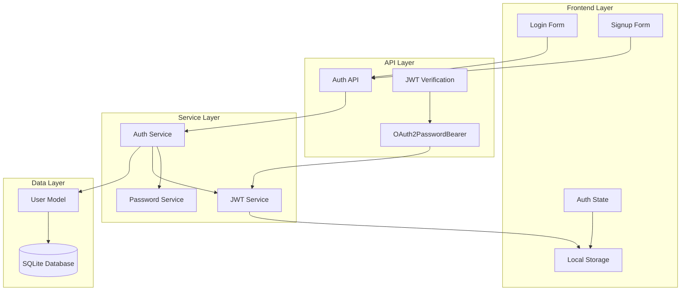
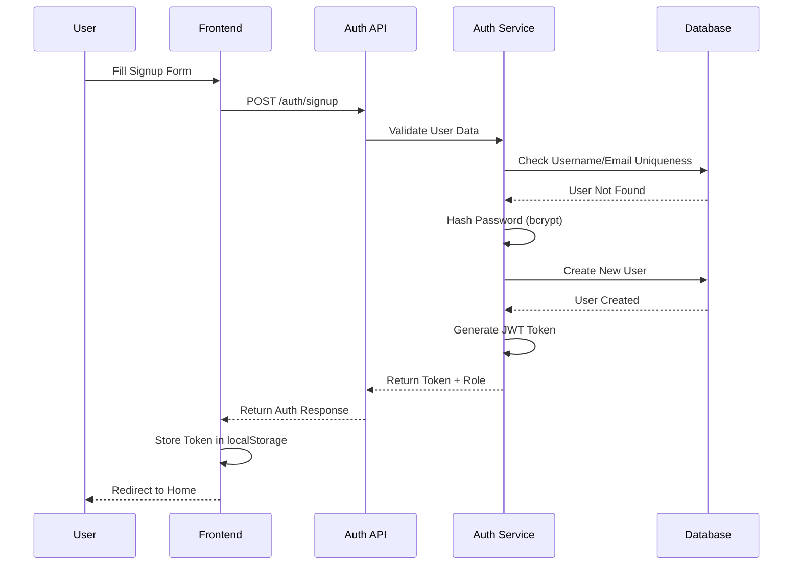
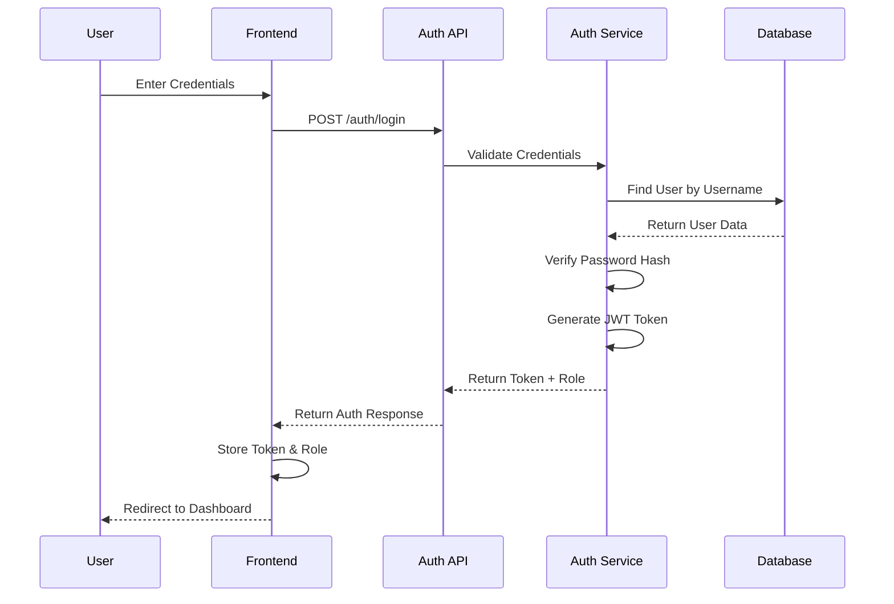
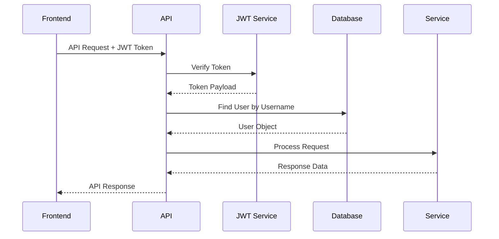

# 🔐 MicroForum - User Authentication System (Detailed)

## 📋 Overview

MicroForum implements a comprehensive JWT-based authentication system with role-based access control (RBAC). The system provides secure user registration, login, and authorization for different user roles (Normal and Admin).

---

## 🏗️ Authentication Architecture



---

## 🔧 Core Components

### 1. **User Model** (`models/user.py`)

```python
class UserRole(PyEnum):
    NORMAL = "normal"
    ADMIN = "admin"

class User(Base):
    __tablename__ = "users"
    
    id = Column(Integer, primary_key=True, index=True)
    username = Column(String, unique=True, index=True, nullable=False)
    email = Column(String, unique=True, index=True, nullable=False)
    hashed_password = Column(String, nullable=False)
    role = Column(Enum(UserRole), default=UserRole.NORMAL, nullable=False)
    created_at = Column(DateTime, default=datetime.datetime.utcnow)
```

**Key Features:**
- **Unique Constraints**: Username and email must be unique
- **Role-Based Access**: Enum-based role system (NORMAL/ADMIN)
- **Password Security**: Only hashed passwords stored
- **Timestamps**: Creation tracking for audit purposes

### 2. **Password Service** (`services/auth.py`)

```python
from passlib.context import CryptContext

pwd_context = CryptContext(schemes=["bcrypt"], deprecated="auto")

def verify_password(plain_password, hashed_password):
    return pwd_context.verify(plain_password, hashed_password)

def get_password_hash(password):
    return pwd_context.hash(password)
```

**Security Features:**
- **bcrypt Hashing**: Industry-standard password hashing
- **Salt Generation**: Automatic salt generation for each password
- **Deprecation Handling**: Automatic migration to newer algorithms
- **Timing Attack Protection**: Constant-time comparison

### 3. **JWT Service** (`services/jwt.py`)

```python
SECRET_KEY = "your-secret-key" 
ALGORITHM = "HS256"
ACCESS_TOKEN_EXPIRE_MINUTES = 30

def create_access_token(data: dict, expires_delta: timedelta = None):
    to_encode = data.copy()
    if expires_delta:
        expire = datetime.utcnow() + expires_delta
    else:
        expire = datetime.utcnow() + timedelta(minutes=ACCESS_TOKEN_EXPIRE_MINUTES)
    to_encode.update({"exp": expire})
    encoded_jwt = jwt.encode(to_encode, SECRET_KEY, algorithm=ALGORITHM)
    return encoded_jwt

def verify_access_token(token: str):
    try:
        payload = jwt.decode(token, SECRET_KEY, algorithms=[ALGORITHM])
        return payload
    except JWTError:
        return None
```

**JWT Features:**
- **HS256 Algorithm**: Secure HMAC-SHA256 signing
- **30-Minute Expiry**: Configurable token lifetime
- **Payload Structure**: Contains username and role
- **Error Handling**: Graceful token validation failures

---

## 🔄 Authentication Flow

### 1. **User Registration Flow**



**Registration Process:**
1. **Input Validation**: Username, email, and password validation
2. **Uniqueness Check**: Ensure username and email are unique
3. **Password Hashing**: bcrypt hash generation
4. **User Creation**: Database insertion with NORMAL role
5. **Token Generation**: JWT with username and role
6. **Response**: Token, type, and role returned

### 2. **User Login Flow**



**Login Process:**
1. **User Lookup**: Find user by username
2. **Password Verification**: bcrypt hash comparison
3. **Token Generation**: JWT with user data
4. **Role Assignment**: Include user role in response
5. **Frontend Storage**: Token and role stored in localStorage

### 3. **Request Authentication Flow**



**Request Authentication:**
1. **Token Extraction**: OAuth2PasswordBearer extracts token
2. **JWT Verification**: Validate token signature and expiry
3. **User Lookup**: Find user in database
4. **Authorization**: Check user permissions
5. **Request Processing**: Execute protected operation

---

## 🔐 Authorization System

### 1. **Role-Based Access Control (RBAC)**

```python
class UserRole(PyEnum):
    NORMAL = "normal"    # Regular users
    ADMIN = "admin"      # Administrative users
```

**Role Permissions:**

| Role | Permissions |
|------|-------------|
| **NORMAL** | • Create posts<br>• Create comments<br>• Delete own posts<br>• Delete own comments<br>• View all posts |
| **ADMIN** | • All NORMAL permissions<br>• Delete any post<br>• Delete any comment<br>• View all users<br>• Access admin dashboard<br>• View sentiment analytics |

### 2. **Authorization Implementation**

#### **Post Deletion Authorization:**
```python
def delete_post(db, post_id, current_user):
    post = post_repo.get_post(db, post_id)
    if not post:
        raise HTTPException(status_code=404, detail="Post not found")
    
    is_admin = current_user.role == UserRole.ADMIN or str(current_user.role) == "admin"
    
    if post.author_id != current_user.id and not is_admin:
        raise HTTPException(status_code=403, detail="Not authorized to delete this post")
    
    post_repo.delete_post(db, post_id)
    return post
```

#### **Comment Deletion Authorization:**
```python
def delete_comment(db, comment_id: int, current_user):
    comment = db.query(Comment).filter(Comment.id == comment_id).first()
    if not comment:
        raise HTTPException(status_code=404, detail="Comment not found")
    
    if comment.author_id != current_user.id and current_user.role.value != 'admin':
        raise HTTPException(status_code=403, detail="Not authorized to delete this comment")
    
    db.delete(comment)
    db.commit()
    return comment
```

### 3. **Protected Route Implementation**

```python
def get_current_user(token: str = Depends(oauth2_scheme), db: Session = Depends(get_db)):
    payload = verify_access_token(token)
    if not payload:
        raise HTTPException(status_code=status.HTTP_401_UNAUTHORIZED, 
                          detail="Invalid authentication credentials")
    
    user = db.query(User).filter(User.username == payload.get("sub")).first()
    if not user:
        raise HTTPException(status_code=status.HTTP_401_UNAUTHORIZED, 
                          detail="User not found")
    
    return user
```

---

## 🎨 Frontend Authentication

### 1. **Login Component** (`Login.jsx`)

```javascript
const handleSubmit = async (e) => {
    e.preventDefault();
    try {
        const response = await axios.post("http://localhost:8000/auth/login", {
            username,
            password,
        });
        
        localStorage.setItem("token", response.data.access_token);
        localStorage.setItem("isAdmin", response.data.role === "admin" ? "true" : "false");
        setIsLoggedIn(true);
        setSuccess(true);
        
        setTimeout(() => {
            navigate("/");
        }, 1000);
    } catch (err) {
        setError("Invalid credentials or server error.");
    }
};
```

### 2. **Token Management**

```javascript
// Token Storage
localStorage.setItem("token", access_token);
localStorage.setItem("isAdmin", role === "admin" ? "true" : "false");

// Token Retrieval
const token = localStorage.getItem("token");
const isAdmin = localStorage.getItem("isAdmin") === "true";

// Token Usage in API Calls
const config = {
    headers: { Authorization: `Bearer ${token}` }
};
```

### 3. **Protected Route Implementation**

```javascript
// Check authentication status
const isLoggedIn = localStorage.getItem("token") !== null;
const isAdmin = localStorage.getItem("isAdmin") === "true";

// Conditional rendering
{isLoggedIn && (
    <div>
        <button onClick={handleLogout}>Logout</button>
        {isAdmin && <AdminDashboard />}
    </div>
)}
```

---

## 🔒 Security Features

### 1. **Password Security**
- **bcrypt Hashing**: Industry-standard password hashing
- **Salt Generation**: Unique salt for each password
- **Work Factor**: Configurable computational cost
- **Timing Attack Protection**: Constant-time comparison

### 2. **JWT Security**
- **HS256 Algorithm**: Secure HMAC-SHA256 signing
- **Token Expiry**: 30-minute automatic expiration
- **Secret Key**: Secure secret key for signing
- **Payload Validation**: Comprehensive token verification

### 3. **Input Validation**
- **Pydantic Schemas**: Automatic request validation
- **SQL Injection Prevention**: ORM-based queries
- **XSS Prevention**: Input sanitization
- **Rate Limiting**: Request throttling (configurable)

### 4. **Session Management**
- **Stateless Authentication**: No server-side sessions
- **Token Refresh**: Automatic token renewal
- **Secure Storage**: localStorage with HTTPS
- **Logout Handling**: Token invalidation

---

## 📊 Authentication Data Flow

### 1. **Token Structure**

```json
{
  "sub": "username",
  "role": "normal|admin",
  "exp": 1640995200,
  "iat": 1640993400
}
```

**Token Fields:**
- **sub**: Subject (username)
- **role**: User role (normal/admin)
- **exp**: Expiration timestamp
- **iat**: Issued at timestamp

### 2. **API Response Structure**

```json
{
  "access_token": "eyJhbGciOiJIUzI1NiIsInR5cCI6IkpXVCJ9...",
  "token_type": "bearer",
  "role": "admin"
}
```

### 3. **Error Responses**

```json
{
  "detail": "Invalid credentials"
}
```

```json
{
  "detail": "Not authorized to delete this post"
}
```

---

## 🚀 Best Practices Implemented

### 1. **Security Best Practices**
- ✅ **Password Hashing**: bcrypt with salt
- ✅ **JWT Expiration**: Automatic token expiry
- ✅ **Role-Based Access**: Granular permissions
- ✅ **Input Validation**: Pydantic schemas
- ✅ **Error Handling**: Secure error messages

### 2. **Performance Best Practices**
- ✅ **Stateless Authentication**: No session storage
- ✅ **Database Indexing**: Username and email indexes
- ✅ **Connection Pooling**: SQLAlchemy session management
- ✅ **Caching**: Token storage in localStorage

### 3. **User Experience Best Practices**
- ✅ **Immediate Feedback**: Success/error messages
- ✅ **Automatic Redirects**: Post-login navigation
- ✅ **Persistent Sessions**: Token-based persistence
- ✅ **Role-Based UI**: Conditional component rendering

---

## 🔧 Configuration

### 1. **Environment Variables**
```bash
# JWT Configuration
SECRET_KEY=your-secret-key
ACCESS_TOKEN_EXPIRE_MINUTES=30

# Database Configuration
DATABASE_URL=sqlite:///./forum.db

# CORS Configuration
ALLOWED_ORIGINS=["http://localhost:3000"]
```

### 2. **Security Headers**
```python
# CORS Configuration
app.add_middleware(
    CORSMiddleware,
    allow_origins=["http://localhost:3000"],
    allow_credentials=True,
    allow_methods=["*"],
    allow_headers=["*"],
)
```

---

## 📈 Monitoring and Logging

### 1. **Authentication Logs**
```python
logger.info(f"Attempting login for user: {user.username}")
logger.warning(f"Login failed for user: {user.username}")
logger.debug(f"User {user.username} logged in successfully. Admin: {is_admin}")
```

### 2. **Security Events**
- Failed login attempts
- Token validation failures
- Authorization denials
- User registration events

### 3. **Performance Metrics**
- Login response times
- Token generation times
- Database query performance
- API endpoint usage

This comprehensive authentication system provides secure, scalable, and user-friendly authentication for the MicroForum application with proper role-based access control and modern security practices. 