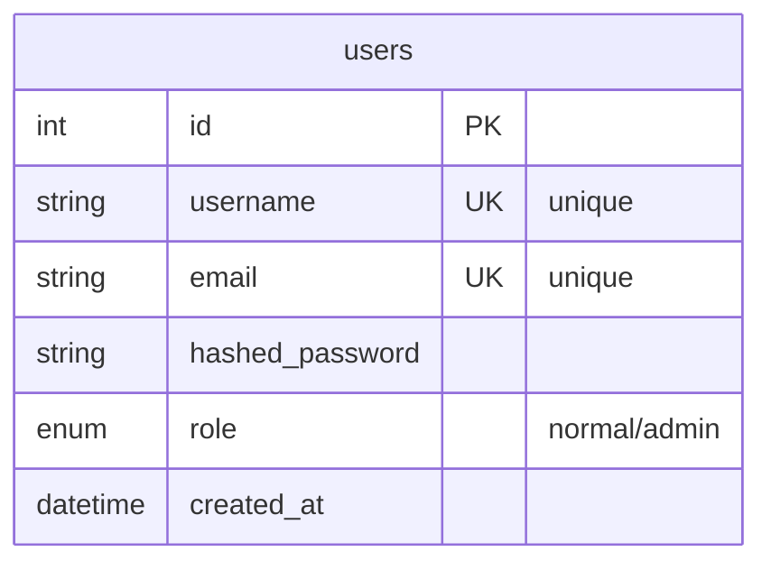

# Users Table

## Table Structure

| Field | Type | Description |
|-------|------|-------------|
| id | Integer | Primary key, unique identifier |
| username | String | Unique username for login |
| email | String | Unique email address |
| hashed_password | String | Encrypted password for security |
| role | Enum | User role: 'normal' or 'admin' |
| created_at | DateTime | Account creation timestamp |

**Purpose**: User account management and authentication 