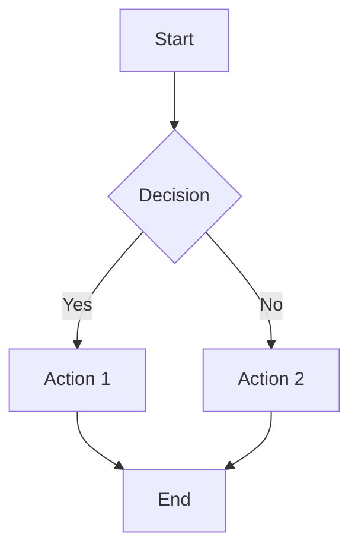

# Example Markdown File

## Basic Syntax

### Headers
# H1 Header
## H2 Header
### H3 Header
#### H4 Header

### Text Formatting
**Bold text** or __bold text__
*Italic text* or _italic text_
***Bold and italic***
~~Strikethrough text~~

### Lists

#### Unordered List
- Item 1
- Item 2
  - Subitem 2.1
  - Subitem 2.2
- Item 3

#### Ordered List
1. First item
2. Second item
3. Third item

### Links
[Link text](https://www.example.com)
[Relative link](./other-file.md)

### Images


### Code

#### Inline Code
Use `code` in a sentence.

#### Code Blocks
```python
def hello_world():
    print("Hello, World!")
    return True
```

```javascript
function greet(name) {
    console.log(`Hello, ${name}!`);
}
```

### Blockquotes
> This is a blockquote.
> 
> It can span multiple lines.

### Tables
| Header 1 | Header 2 | Header 3 |
|----------|----------|----------|
| Cell 1   | Cell 2   | Cell 3   |
| Cell 4   | Cell 5   | Cell 6   |

### Horizontal Rules
---
or
***

### Task Lists
- [x] Completed task
- [ ] Pending task
- [ ] Another task

## Advanced Features

### Mermaid Diagrams


### Mathematical Expressions
Inline math: $E = mc^2$

Block math:
$$
\int_{-\infty}^{\infty} e^{-x^2} dx = \sqrt{\pi}
$$

### Footnotes
Here's a sentence with a footnote[^1].

[^1]: This is the footnote content.

### Collapsible Sections
<details>
<summary>Click to expand</summary>

This content is hidden by default and can be expanded by clicking.
</details>

## Best Practices

1. **Use descriptive headers** for better navigation
2. **Keep line length** reasonable (80-120 characters)
3. **Use consistent formatting** throughout the document
4. **Include a table of contents** for long documents
5. **Use relative links** when possible
6. **Add alt text** to images for accessibility

## Common Use Cases

- **Documentation**: API docs, user guides
- **README files**: Project descriptions
- **Notes**: Meeting notes, study materials
- **Blog posts**: Content creation
- **Technical writing**: Specifications, procedures 